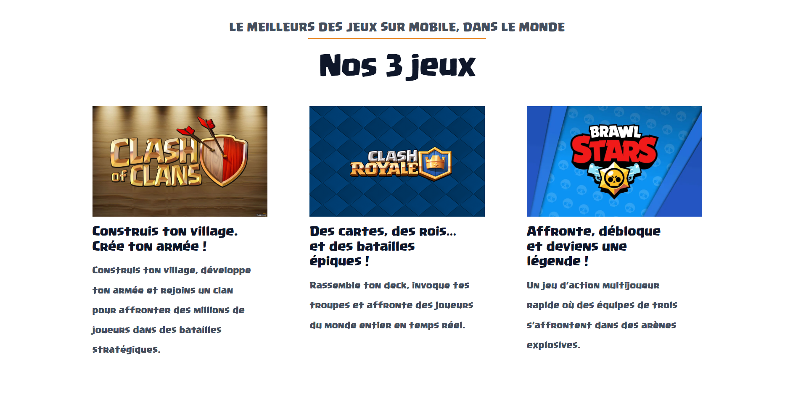

## Thème parent
[Astra](https://wordpress.org/themes/astra/)
## Footer
- Personnalisation du footer via surcharge du template `footer.php`.
- Refait de A a Z

## Hero
- Ajout d’une section Hero sur la page d’accueil.
- changement d'arriere plan du texte et sinon bouton de base s'astra 

## Sections supplémentaires
- Ajout de 2 sections personnalisées sous le Hero.
- Mise en page et typographie via CSS.

## CSS et style
- Changement de background .
- Changement de font .
- Ajustement des typographies pour titres et paragraphes.
- Amélioration du layout responsive.

## Hooks et templates
- Utilisation de hooks WordPress pour injecter du contenu dans le footer et le header :
   "astra_footer" et "astra_primary_content_top"
- Surcharge de `footer.php` pour adapter le design.
- Création de template-parts pour les sections personnalisées si nécessaire.
  
## Notes sur les templates Spectra
-Certaines élément utilisent des templates créées avec le plugin Spectra. Ces templates sont stockées dans la base de données et ne sont pas incluses dans le thème enfant. 

### Avant Hero 

### Après Hero

### Avant footer 

### Après footer

### Avant Section 1

### Après Section 1

### Avant Section 2

### Après Section 2

### Section de ma template (hors child)

